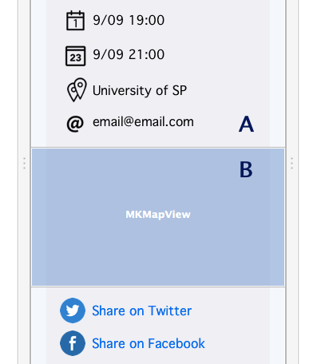

ETFlowView
========
It's simple. You have many many views inside your controller. You change the frame of one of them. You breath. And then you have to manually update every single frame on the hierarchy to fill the missing gap.

**ETFlowView** is an automatic layout engine, so every single subview will be updated when the frame of a view in the hierarchy is changed.

As a web or Android developer, you must be surprised that this project even exists, since Apple should have implemented it many many years ago.

Installation
--------
Clone this repo and copy the folder **ETFlowView** into your Xcode project.

How-to
--------


**ETFlowView** can be user both programmatically or loaded automatically from a nib.

### Nib

If you are going to load it from a nib, just load a standard `UIScrollView` from the elements panel and change its class to `ETFlowView`:


If you need to reference it on code, just make an IBOutlet out of it:

@property (strong, nonatomic) IBOutlet ETFlowView *view;`

### Programmatically

Programmatically, just alloc it and set its frame:

```
[[ETFlowView alloc] initWithFrame:CGRectMake(0.0, 0.0, self.view.frame.size.width, self.view.frame.size.height)];
```

### Trigger

The **recommended** way is to manually update the hierarchy. To do this, just call `- (void)updateView:(UIView *)view toFrame:(CGRect)newFrame;` with the updated size of any view. You can use `sizeThatFits:` to help on your frame's calculations, but don't forget to call the aforementioned method.

Otherwise, if you want KVO enabled on every view of the hierarchy, you should set `_shouldBind` to `YES`. On this mode, all elements will be automatically bound whenever you call `addSubView` or `removeFromSuperview`. Unfortunatelly, Apple's implementation doesn't follow keyPath:frame properly, **so missed calls occur frequently**.

Everytime a view is resized, `ETFlowView` will update its `contentSize` property to perfectly fit the content.

### Absolute

Remember that, if your element is absolute positioned, it will not be affected by the algorithm. That's very important, since sometimes designers want to build very complex layouts that do not make sense programatically. Here is an example:



If view B is resized, it will not affect any of the elements on view A. That happens because view B is not a child neither a parent of view A (it's actually a sibling), which means it is absolute positioned and will not affect any of its siblings.

Support
--------
Just open an issue on Github and we'll get to it as soon as possible.

About
--------
**ETFlowView** is brought to you by Trilha.
